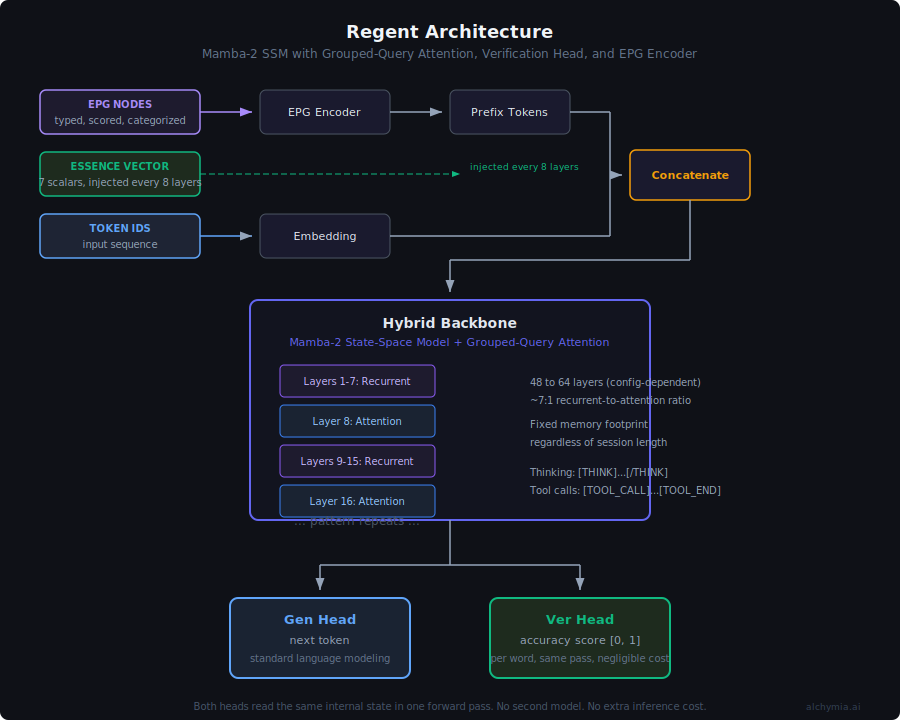

# Regent Model

Two distributions, same architecture.

| Variant | Scale | License | Distribution |
|---|---|---|---|
| **Regent** | 7B to 50B | [Regent Community License](LICENSE) | This repository |
| **Grande Regent** | 70B to 1T | Commercial | Alchymia Groom |

This repository is the open source Regent. Grande Regent is shipped separately by Alchymia AI.

## Why this exists

We were building a cognitive system for physical agents — robots, drones, platforms that act in the real world. We were running its language layer on a third-party API. Three walls kept appearing.

The first wall: the model could not tell when it was wrong. We could catch hallucinations after the response was finished, by sampling multiple times or running a second model, but the bad output was already formed. For something that issues physical commands, post-hoc detection is not a correction — it is an incident report.

The second wall: knowledge was stateless. Every prompt re-injected the same graph of facts, relationships, and context the system already knew. The graph grew. The prompt cost grew. Nothing accumulated. Each call started from scratch.

The third wall: the cognitive model we were building is defined as a state-space process — a recurrence with decay, input gating, and memory integration. We were translating that math into English sentences and feeding it to a transformer. The transformer matched patterns in the words. It did not run the dynamics. We were approximating our own model with a model that could not represent it.

None of these could be fixed from the outside. So we built the inside.

Regent is a hybrid Mamba-2 language model with two output heads. One predicts the next token. The other predicts whether that token is grounded or fabricated. Both heads read the same hidden states in one forward pass.

Mamba-2's selective scan is the same recurrence equation as the cognitive model's state update. The dynamics are in the weights, not in the prompt.

## What it is

A self-contained language model. Ships as weights and code. No API dependency.

<p align="center">
  
</p>

- Hybrid backbone: Mamba-2 layers with sparse Grouped Query Attention at an 8:1 ratio
- Two output heads: generation (logits) and verification (per-token grounding score)
- EPG encoder: knowledge graph nodes encoded as dense prefix embeddings instead of serialized text
- Essence conditioning: 7-dimensional affective state vector injected into hidden layers
- Regent (open source): 7B, 13B, 30B, 50B
- Grande Regent (commercial): 70B, 200B, 500B, 1T

## What makes it different

Six things this model does that other language models do not.

**1. It scores its own grounding while it writes.**
The model has two output heads. One produces the next word. The other produces a number between 0 and 1 for the same word, where 1 means "this is backed by what I know" and 0 means "I am making this up." Both heads run on every word, in the same pass. Other systems detect hallucinations after the response is finished, by re-running the model multiple times or sending the output to a second model. This one knows in real time.

**2. It changes how it writes when its confidence drops.**
The grounding score gates the writing behavior into three modes. Above 0.6 it writes normally. Between 0.3 and 0.6 it slows down, lowers temperature, and picks safer words. Below 0.3 it stops, looks up relevant facts from the knowledge graph, and tries again from the point where it got uncertain. Other models keep writing at the same speed and confidence regardless of whether they are right or wrong.

**3. EPG Encoder: it reads structured knowledge as itself, not as text.**
The Entity Preference Graph (EPG) is the model's external knowledge store. It holds typed nodes: facts, beliefs, relationships, memories, each one tagged with how confident the model is in it, how recently it was used, whether it was a good or bad experience, and what kind of knowledge it is. Most systems flatten this into English sentences and stuff it into the prompt. This one feeds the nodes directly to the model as compressed inputs that sit in front of the conversation. The model treats them as native knowledge instead of a wall of text it has to read.

**4. Essence Vector: its mood is a dial, not a paragraph at the top of the prompt.**
The model takes a 7-number input alongside the conversation. Those seven numbers describe the model's current emotional and motivational state: how positive it feels, how strongly that feeling should affect its output, how much it values truth, civility, kindness, curiosity, and self-preservation. The numbers get fed into the model at multiple points during the forward pass, so the entire response is shaped by them. Other models use a persona description in the prompt, which the model has to keep remembering as the response gets longer. This is a constant signal applied at every layer.

**5. It uses constant memory no matter how long the conversation is.**
Most language models keep a record of every word they have processed in something called a KV cache. The cache grows with the conversation. For an 8-hour session this becomes gigabytes. This model uses a different math (state space models) where the memory of past words is compressed into a fixed-size buffer. For the 7B variant that buffer is roughly 2 megabytes. It does not grow. A drone can run a multi-hour mission without hitting a memory wall. A robot can run a full shift.

**6. It runs the verification head for free.**
The grounding head is about one-tenth of one percent of the model's total size. It reads the same internal numbers the writing head reads, so it does not need a separate forward pass. Adding hallucination detection costs almost nothing in compute or memory. Most safety systems double or triple the cost.

## How the verification head works

During generation, the verification head outputs a score in [0, 1] for every token. The decoding loop gates on it.

| Score | Zone | Behavior |
|---|---|---|
| > 0.6 | Flow | Sample normally with the configured temperature and top-p |
| 0.3 to 0.6 | Caution | Drop temperature to 0.3, bias toward conservative tokens |
| < 0.3 | Halt | Stop, retrieve relevant EPG nodes, re-decode |

One forward pass. The verification head is a 2-layer MLP on the same hidden states the generation head reads. It adds about 0.1% to the parameter count.

## Why Mamba-2 instead of a transformer

Two reasons.

First, the state. Mamba-2 has a fixed-size recurrent state. For the 7B config it is ~1 GB regardless of session length. A transformer's KV cache grows linearly with context — 50+ GB for long sessions. Regent runs for hours, days, or weeks at the same fixed cost. A transformer hits a memory wall. Mamba-2 does not.

Second, the math. The whitepaper defines cognition as a state-space process with a decay term, an input-gated update, and a memory contribution. Mamba-2's selective scan is that equation. We get the whitepaper's dynamics in the weights instead of approximating them through attention over text.

The downside of pure Mamba is precision recall. A fixed-size state cannot losslessly remember a specific token from 5000 positions ago. We solve this by interleaving GQA attention layers every 8 blocks. Attention handles precise recall over a sliding window. Mamba handles compression.

## Repository layout

```
regent-model/
├── ARCHITECTURE.md           Technical specification
├── ADDING_MODEL_SIZES.md     How to define new configurations
├── configs/                  Model configs (YAML)
├── regent_model/             Model code
│   ├── blocks/               Mamba-2 and GQA blocks
│   ├── layers/               Full RegentModel
│   ├── heads/                Gen Head and Ver Head
│   ├── encoder/              EPG encoder
│   └── utils/                Tokenizer, data loaders, configs
├── scripts/                  Training and pipeline scripts
├── serve/                    Inference server
├── tests/                    Architecture tests
└── docs/                  Static site
```

## Setup

Python 3.11+. MLX for Apple Silicon, PyTorch for CUDA.

**Apple Silicon (MLX)**

```bash
brew install python@3.12
python3.12 -m venv .venv
source .venv/bin/activate
pip install mlx pyyaml sentencepiece numpy fastapi uvicorn pydantic
```

**NVIDIA GPU (PyTorch + CUDA)**

```bash
python3.12 -m venv .venv
source .venv/bin/activate
pip install torch --index-url https://download.pytorch.org/whl/cu124
pip install pyyaml sentencepiece numpy fastapi uvicorn pydantic safetensors transformers
# Optional: Triton SSD kernel for maximum scan throughput
pip install mamba-ssm causal-conv1d
```

Validate the architecture builds and gradients flow.

```bash
PYTHONPATH=. python3 tests/test_architecture.py
```

## Training

Four phases. Each loads the previous phase's final checkpoint as its starting point.

| Phase | Trains | Objective |
|---|---|---|
| 1. Base | Full model | Language modeling on a general corpus |
| 2. Identity | Full model + EPG encoder | SFT on Regent conversations |
| 3. Verification | Ver Head only (backbone frozen) | Per-token grounding score predictor |
| 4. Alignment | Full model (low LR) | DPO against a frozen reference copy |

Run all four sequentially.

```bash
PYTHONPATH=. python3 scripts/run_pipeline.py \
    --config configs/regent_7b.yaml \
    --scrape-config pipeline.yaml
```

See [QUICKSTART.md](QUICKSTART.md) for the full end-to-end guide from data to deployment.

See [API.md](API.md) for the complete API reference: inference, chat, tool calling, thinking, verification, knowledge graph input, sessions, and the OpenAI-compatible endpoint.

## Inference

Start the model server and the UI together.

```bash
./start.sh
```

This starts the FastAPI model server on port 8400 and the Nuxt UI on port 3000. Both log to `logs/`. Press `Ctrl+C` to stop both.

| URL | Purpose |
|---|---|
| http://localhost:3000 | Model Studio UI |
| http://localhost:8400 | API server |

Options.

```bash
./start.sh --config configs/regent_7b.yaml \
           --model  checkpoints/alignment/step_N.safetensors \
           --port   8400 \
           --ui-port 3000
```

| Flag | Default | Description |
|---|---|---|
| `--config` | `configs/regent_370m.yaml` | Model config YAML |
| `--model` | none | Weights file (.safetensors). Omit to run on random init for architecture testing. |
| `--tokenizer` | `data/tokenizer/regent.model` | SentencePiece tokenizer |
| `--port` | 8400 | API server port |
| `--ui-port` | 3000 | Nuxt dev server port |

To start only the API server without the UI.

```bash
PYTHONPATH=. python3 -m serve.server \
    --config configs/regent_7b.yaml \
    --model checkpoints/alignment/step_N.safetensors \
    --tokenizer data/tokenizer/regent.model \
    --port 8400
```

| Method | Path | Purpose |
|---|---|---|
| GET | /health | Liveness check |
| GET | /info | Model config and parameter count |
| POST | /generate | Generate with verification-gated decoding |
| POST | /verify | Score existing text without generating |

Generate request body.

```json
{
  "messages": [
    {"role": "user", "content": "What do you know about this?"}
  ],
  "essence": {
    "essence_index": 6.5,
    "truth_vs_lie": 0.8
  },
  "max_tokens": 512,
  "verification": true,
  "grounding_threshold": 0.4
}
```

Response includes generated text, per-token grounding scores, and halt positions.

## Model Studio UI

The UI runs at `http://localhost:3000` when started via `./start.sh`. It has six pages.

**Dashboard**

Server health, model load status, and training phase at a glance. Shows total parameter count and active model config. Lists all checkpoints with phase, file size, and timestamp. Lists active inference sessions with token counts and idle time, with a button to drop any session.

**Inference**

Chat interface with full access to Regent's runtime controls.

- Essence vector — 7 sliders (mood, influence, truth, civility, good/evil, curiosity, self-preservation) that shape every token in the response
- EPG nodes — select any nodes from your domain knowledge store to inject as grounded prefix context; searchable and filterable
- Generation settings — temperature, max tokens, grounding threshold slider
- Per-token grounding scores — each assistant token is colour-coded green/amber/red by its verification score; halts are shown as inline badges
- Stats bar — total tokens, inference time, halt count, mean grounding score per response
- Session management — new session button resets KV/SSM cache

**Domain Knowledge**

Manage the EPG node store that feeds into inference.

- Browse all nodes in a table with confidence, activation, and valence bars per row
- Filter by category (15 categories: identity, belief, capability, experience, goal, domain, relationship, emotional, procedural, episodic, semantic, preference, constraint, meta, other)
- Full-text search across key and value fields
- Add, edit, or delete nodes via a modal form; all fields editable (key, value, category, confidence, activation, valence, emotional weight)
- Ingest tab — paste a JSON array of nodes, preview before importing, import in bulk

**Data Pipeline**

Guided 5-step wizard for building a training corpus from scratch.

- Step 1 (Sources) — enter web URLs (one per line) and/or HuggingFace dataset references (dataset name, split, text column, max docs)
- Step 2 (Scraping) — live progress: URL count, doc count, threshold bar, current URL, scrape log; stop at any time
- Step 3 (Review) — corpus summary (train/val split, total docs, MB on disk) with quality indicator; sample document preview
- Step 4 (Configure) — pick model config, start stage, and checkpoint directory; shows a plain-English run plan before you commit
- Step 5 (Training) — phase pipeline with active phase highlighted; live training log with loss/step lines coloured; checkpoint list updated in real time

**Training**

Direct training controls without the pipeline wizard. Start or stop training at any stage, pick a start stage and config, and resume from any saved checkpoint. Live log with colour-coded lines (loss steps in indigo, errors in red, warnings in amber).

**Export**

Export a trained checkpoint to a deployable format.

- Pick any checkpoint from the list
- Pick a model config (370M / 1.5B Edge / 7B / production)
- Choose format: HuggingFace Transformers, Docker/server package, or both
- Choose dtype: float32, float16, or bfloat16 (with device recommendation shown for each)
- Fill in model card metadata (description, license, tags) and optionally push directly to HuggingFace Hub
- Live export log streamed from the server
- Post-export code snippet updates dynamically with the chosen dtype and target device

## Target markets

Workloads where constant-memory inference, per-token grounding, native knowledge graph input, or self-hosting matter more than raw benchmark quality.

### Legal research and drafting

Hallucination in legal output is a known and quantified problem. Case law and statutes are graph-shaped, which the EPG encoder ingests directly. Self-hosting fits attorney-client privilege. The Ver Head gives associates a per-sentence confidence signal before a brief reaches a partner.

### Financial research and risk

Long analyst sessions over structured market data. Risk teams need every claim traceable. The Ver Head is the audit trail. Bloomberg-style workflows fit the session profile.

### Healthcare and clinical decision support

UMLS, SNOMED, and ICD are structured ontologies the EPG encoder consumes natively. Long patient histories require constant memory. Hallucination has clinical consequences. The verification head provides the grounding signal clinical workflows demand.

### Government, defense, and intelligence

Air-gap deployment is a hard requirement that eliminates API-based competitors. The model ships as weights and runs on local hardware. The Ver Head produces auditable grounding scores. Sovereign AI procurement is a stated priority across allied governments.

### Robotics

Physical robots running continuous control loops cannot accumulate memory over an 8-hour shift. Regent's fixed memory state never grows regardless of duration. The Ver Head lets the planner reject actions whose justification is fabricated, before the action is executed.

### Drones and autonomous vehicles

Long missions, intermittent connectivity, safety-critical decisions. Constant-memory inference lets a drone run a multi-hour survey without hitting a memory wall. Self-contained deployment removes cloud dependency. Per-token grounding flags uncertain perception narratives before they propagate into navigation or targeting.

### Industrial automation and embodied AI platforms

Warehouse robots, agricultural systems, last-mile delivery, humanoid platforms. The architecture was built for persistent embodied operation. As embodied AI matures, the model is positioned as the cognitive layer that other components plug into.

### Pharmaceutical and drug development

Molecular databases, drug interaction graphs, and clinical trial data are graph-shaped. The EPG encoder ingests them directly. Regulatory submissions to the FDA or EMA require every claim to be auditable at the source. Wrong output has patient consequences. Trial data often cannot leave a jurisdiction.

### Nuclear and critical infrastructure

Air-gap is mandatory. Shift monitoring runs 8 to 12 hours — fixed memory handles this without degradation. The accuracy score flags uncertain operational recommendations before an operator acts on them. No cloud vendor has clearance to run inside a nuclear facility.

### Maritime and offshore

Ships at sea have no reliable internet for weeks. Engine monitoring, navigation decisions, and cargo management need a model that runs offline for the duration of a voyage. Long sessions and fixed memory match the operational profile exactly.

### Mining and extraction

Remote sites, intermittent or zero connectivity, safety-critical decisions about equipment and personnel. Long operational cycles. The accuracy score gates decisions before they become incidents. The deployment model requires no ongoing infrastructure.

### Insurance and claims

Every claims decision needs a traceable justification for regulatory review. Structured knowledge of policies, precedents, and actuarial tables fits the EPG encoder. Long review sessions benefit from fixed memory. The accuracy score is the audit trail the regulator asks for.

### Compliance and regulatory affairs

Pharmaceutical submissions, financial regulatory reporting, environmental compliance — all require AI output auditable at the claim level. Regulatory frameworks are graph-shaped: rules, exceptions, cross-references. General models produce plausible-sounding compliance text with no verifiability.

### Emergency services and disaster response

Works offline when infrastructure is down. Medical triage, search and rescue coordination, resource allocation. Response time matters. A model that requires connectivity is unavailable exactly when it is needed most. Behavioral conditioning keeps output calibrated for high-stakes decisions.

### Audit and financial forensics

Every figure needs a source. Long document review sessions over structured financial data. The accuracy score tells the auditor which claims to scrutinize before the report is finalized. Self-hosting removes the conflict of sending client financial data to a third-party API.

### Agriculture and precision farming

Smallholder farmers in regions with unreliable connectivity. Structured knowledge of crop disease, soil types, weather patterns, and market prices fits the EPG format. Zero marginal cost after deployment is the only viable economic model at this scale. Self-hosted deployment is the only distribution path that reaches this market.

### Where the model is not positioned to play

General consumer chat, code assistants, multimodal vision-language, benchmark leaderboards. These are won by raw scale and training compute. The Regent Model competes on properties, not parameter count.

## Availability

**Regent (7B to 50B)**. This repository. Architecture, training pipeline, inference server, and the 7B through 50B checkpoints. Released under the Regent Community License.

**Grande Regent (70B to 1T)**. Frontier checkpoints with the production-trained verification head, production EPG tooling, and enterprise integrations. Distributed through Alchymia Groom. Commercial license.

## License

Regent is released under the [Regent Community License](LICENSE). You can use, modify, and redistribute it for any purpose, including commercial, with one restriction: you cannot offer Regent or its derivatives as a hosted inference service to third parties without a commercial license from Alchymia.

Building products that use Regent internally, deploying it for your own users, research, education, and consulting are all permitted. See the full [LICENSE](LICENSE) for details.

Grande Regent is distributed through Alchymia Groom under a separate commercial license.

Copyright (c) 2026 Alchymia AI Research Labs. All rights reserved.

## Contact

research@alchymia.ai
